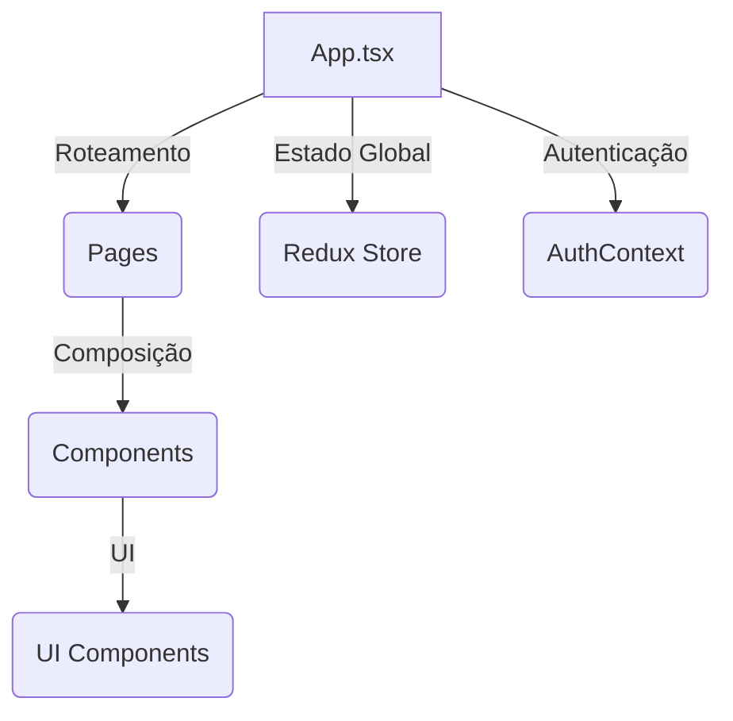
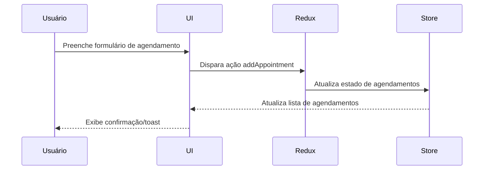

# Documentação do Projeto AquaWash Pro

## Sumário

- [Visão Geral](#visão-geral)
- [Decisões Arquiteturais](#decisões-arquiteturais)
- [Instruções de Setup](#instruções-de-setup)
- [Guia de Estilo de Código](#guia-de-estilo-de-código)
- [Diagramas](#diagramas)

---

## Visão Geral

AquaWash Pro é um sistema web para agendamento de serviços de lava jato, com foco em experiência do usuário, controle de agendamentos e gestão de profissionais.

---

## Decisões Arquiteturais

- **Frontend:**

  - React + TypeScript
  - Vite para build e desenvolvimento
  - TailwindCSS para estilização
  - React Router para navegação
  - Context API para autenticação
  - Redux Toolkit para estado global de agendamentos
  - Lazy loading para otimização de performance
  - Sentry para monitoramento de erros

- **Componentização:**

  - Componentes reutilizáveis em `/components/ui`
  - Páginas em `/pages`
  - Contextos em `/contexts`
  - Hooks customizados em `/hooks`

- **Testes:**
  - Testes unitários com Jest + React Testing Library em `/test`
  - Testes automatizados com Cypress em `/cypress`

---

## Instruções de Setup

### Pré-requisitos

- Node.js >= 18.x
- Yarn ou npm

### Passos para rodar o projeto

1. **Clone o repositório:**

   ```sh
   git clone https://github.com/whybiel/aquawash-pro
   cd aquawash-pro
   ```

2. **Instale as dependências:**

   ```sh
    yarn install
    # ou
    npm install
   ```

3. **Inicie o servidor de desenvolvimento:**

   ```sh
   yarn dev
   # ou
   npm run dev
   ```

4. **Abra o navegador:**
    ```sh
   Acesse `http://localhost:8080` para ver o aplicativo em execução.
   ```
   

5. **Para rodar os testes:**

   ```sh
   yarn test
   # ou
   npm test
   ```

6. **Para rodar os testes end-to-end:**
   ```sh
   yarn cypress open
   # ou
   npx cypress open
   ```

### Guia de Estilo de Código

- Padrão:
  -- TypeScript para tipagem estática
  -- ESLint + Prettier configurados
  --Nomes de componentes em PascalCase
  --Funções e variáveis em camelCase
  --Separação clara entre lógica, apresentação e estilos

-Boas práticas:
--Componentes pequenos e reutilizáveis
--Uso de hooks para lógica compartilhada
--Comentários JSDoc em funções públicas
--Evitar lógica de negócio em componentes de UI

## Diagramas

Arquitetura do sistema:

## Arquitetura do Sistema



Fluxo de Dados: Agendamento



Estrutura de Pastas

```sh
src/
├── components/
│   ├── auth/
│   ├── booking/
│   ├── dashboard/
│   ├── feedbacks/
│   ├── layout/
│   ├── sections/
│   └── ui/
├── contexts/
│   └── AuthContext.tsx
├── hooks/
│   └── use-toast.ts
├── lib/
│   └── utils.ts
├── pages/
│   ├── Booking.tsx
│   ├── Dashboard.tsx
│   ├── Index.tsx
│   └── NotFound.tsx
├── services/
│   └── getFeedbacks.ts
├── store/
│   ├── hooks.ts
│   ├── index.ts
│   ├── selectors/
│   └── slices/
├── test/
├── types/
└── App.tsx
```
